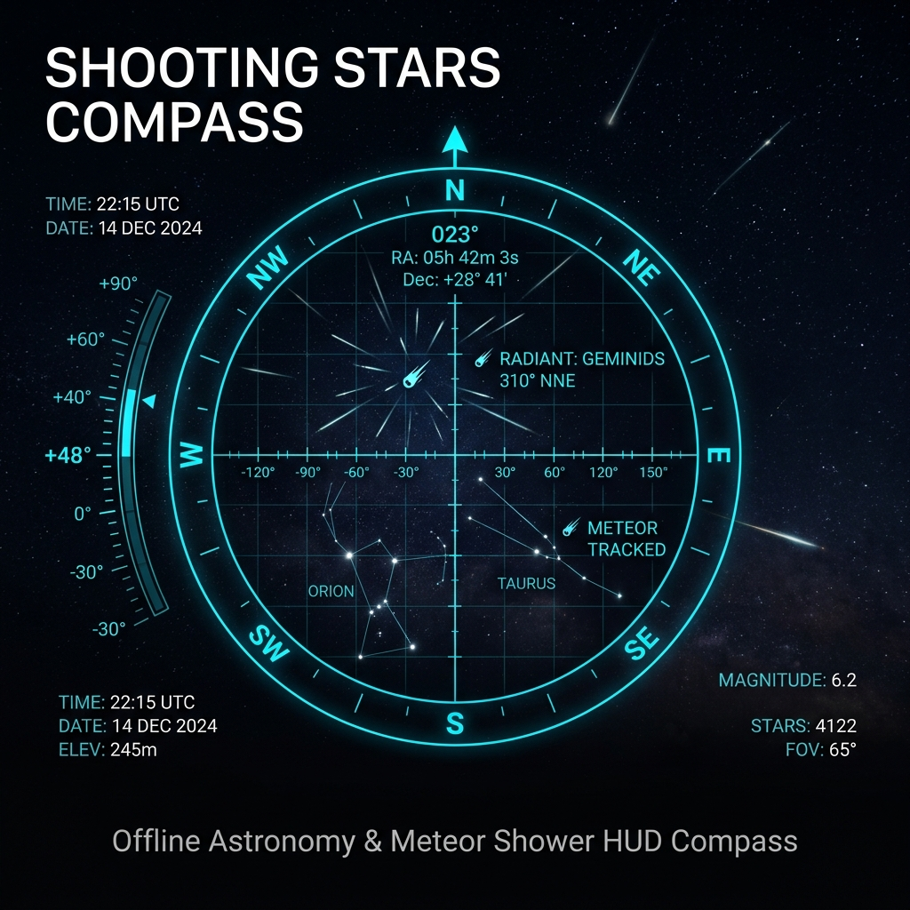

# 🌌 Shooting Stars Compass

[English](#english) | [Italiano](#italiano)

---

## 🇬🇧 English

**Shooting Stars Compass** is an offline-first Progressive Web App (PWA) and augmented-reality Heads-Up Display (HUD) astronomical compass designed to guide stargazers and astronomy enthusiasts toward the **radiant point** of major meteor showers (such as the Perseids, Geminids, Orionids, and Quadrantids).

### 🌟 Key Features

- ☄️ **Real-Time Astronomical Tracking**: Dynamically calculates and updates the active meteor shower radiant's **Azimuth** and **Altitude/Elevation** based on current GPS coordinates and Local Sidereal Time (LST).
- 🧭 **Responsive HUD Viewfinder**: 3D orientation targeting using the device's built-in gyroscope, accelerometer, and digital compass.
- 🌐 **Multilingual Support (EN | IT)**: Instant language toggle between English and Italian without page reloads.
- 📱 **Offline-First PWA**: Fully functional without cellular or internet coverage (ideal for remote dark-sky locations) powered by Service Workers.
- 🎨 **Night-Vision Dark Mode**: Futuristic high-contrast dark theme engineered to preserve night-adjusted vision during dark sky observations.

---

### ☄️ Supported Meteor Showers

The application comes pre-loaded with ephemeris data for major annual meteor showers:

| Meteor Shower | Active Period | Peak Date | ZHR (Meteors/hr) |
| :--- | :--- | :--- | :--- |
| **Perseids** | Jul 17 - Aug 24 | Aug 12-13 | ~100 |
| **Geminids** | Dec 4 - Dec 17 | Dec 13-14 | ~120 |
| **Orionids** | Oct 2 - Nov 7 | Oct 21-22 | ~20 |
| **Quadrantids** | Dec 28 - Jan 12 | Jan 3-4 | ~110 |
| **Lyrids** | Apr 16 - Apr 25 | Apr 22-23 | ~18 |
| **Eta Aquariids** | Apr 19 - May 28 | May 5-6 | ~50 |

---

### 🛠️ Built With

- **HTML5 & CSS3**: Lightweight responsive UI without heavy frameworks (CSS Variables, Flexbox, Grid, Glassmorphism).
- **Vanilla JavaScript (ES6+)**: Spherical trigonometry algorithms, Local Sidereal Time (LST) calculations, and equatorial (RA/Dec) to horizontal coordinate (Az/Alt) conversions.
- **Web APIs**:
  - `DeviceOrientationEvent` (Digital Compass & Gyroscope)
  - `Geolocation API` (GPS Coordinates)
  - `Service Worker API` (Offline caching & PWA)

---

### 🚀 Getting Started

1. Visit the live app on [GitHub Pages](https://danielzotti.github.io/shooting-stars-compass/).
2. Click **"START & ENABLE SENSORS"** and allow access to location and device orientation sensors.
3. Select your target meteor shower from the top dropdown menu.
4. Rotate and tilt your phone until the radiant icon ☄️ locks onto the center of the HUD reticle.

---

## 🇮🇹 Italiano

**Shooting Stars Compass** è un'applicazione web progressiva (PWA) offline-first e bussola astronomica in realtà aumentata (HUD) progettata per guidare gli appassionati di astronomia verso il **radiante** dei principali sciami meteorici (come le Perseidi, Geminidi, Orionidi e Quadrantidi).

### 🌟 Caratteristiche Principali

- ☄️ **Puntamento Astronomico in Tempo Reale**: Calcola e aggiorna dinamicamente **Azimut** ed **Elevazione/Altitudine** del radiante attivo in base alla posizione GPS corrente e all'ora solare locale (LST).
- 🧭 **Mirino HUD Reattivo**: Orientamento visuale 3D mediante giroscopio, accelerometro e bussola integrati nel dispositivo.
- 🌐 **Multilingua (IT | EN)**: Cambio istantaneo della lingua senza ricaricare la pagina.
- 📱 **PWA Offline-First**: Funziona anche in assenza di segnale cellulare (idealmente per luoghi bui o di montagna) grazie al Service Worker integrato.
- 🎨 **Interfaccia Night-Vision Dark Mode**: Design futuristico a contrasto ideale per mantenere l'adattamento della vista al buio durante l'osservazione notturna.

---

### ☄️ Sciami Meteorici Supportati

L'applicazione include dati di effemeridi precalcolati per i principali sciami meteorici dell'anno:

| Sciame Meteorico | Periodo di Attività | Picco Massimo | ZHR (Meteore/ora) |
| :--- | :--- | :--- | :--- |
| **Perseidi** (Lacrime di San Lorenzo) | 17 Lug - 24 Ago | 12-13 Agosto | ~100 |
| **Geminidi** | 4 Dic - 17 Dic | 13-14 Dicembre | ~120 |
| **Orionidi** | 2 Ott - 7 Nov | 21-22 Ottobre | ~20 |
| **Quadrantidi** | 28 Dic - 12 Gen | 3-4 Gennaio | ~110 |
| **Liridi** | 16 Apr - 25 Apr | 22-23 Aprile | ~18 |
| **Eta Aquaridi** | 19 Apr - 28 Mag | 5-6 Maggio | ~50 |

---

### 🛠️ Tecnologie Utilizzate

- **HTML5 & CSS3**: Layout responsivo senza framework pesanti (CSS Variables, Flexbox, Grid, Glassmorphism).
- **Vanilla JavaScript (ES6+)**: Calcoli di trigonometria sferica, tempo siderale locale (LST) e trasformazioni di coordinate equatoriali (Ascensione Retta, Declinazione) in coordinate orizzontali.
- **Web APIs**:
  - `DeviceOrientationEvent` (Bussola & Giroscopio)
  - `Geolocation API` (Coordinate GPS)
  - `Service Worker API` (Caching statico & supporto Offline)

---

### 🚀 Come Utilizzare l'App

1. Apri la demo online su [GitHub Pages](https://danielzotti.github.io/shooting-stars-compass/).
2. Clicca su **"AVVIA E ATTIVA SENSORI"** e consenti l'accesso alla posizione GPS e ai sensori di orientamento.
3. Seleziona lo sciame meteorico desiderato dal menu in alto.
4. Ruota il tuo smartphone finché l'icona del radiante ☄️ non si allinea al centro del mirino HUD.

---

## 📄 License / Licenza

Distributed under the **MIT License**. See `LICENSE` for more information.

---

*Developed with ❤️ by [Daniel Zotti](https://github.com/danielzotti)*
